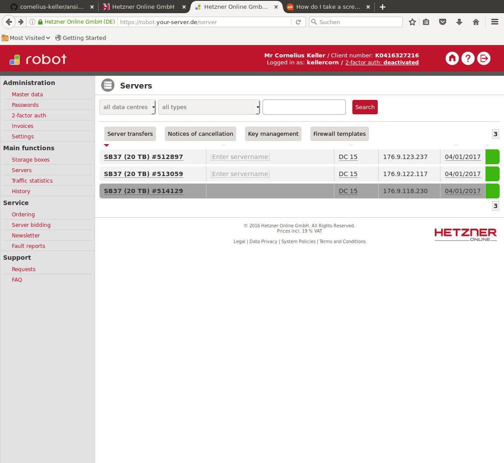
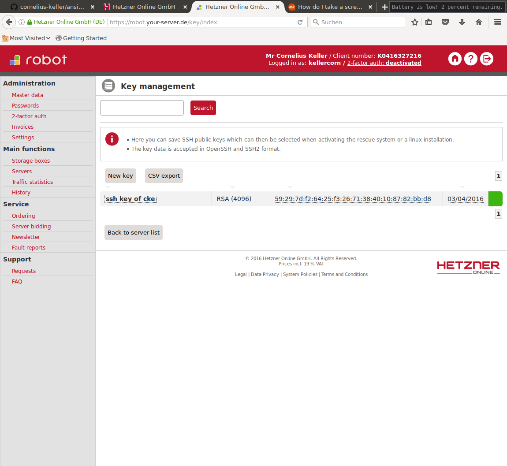
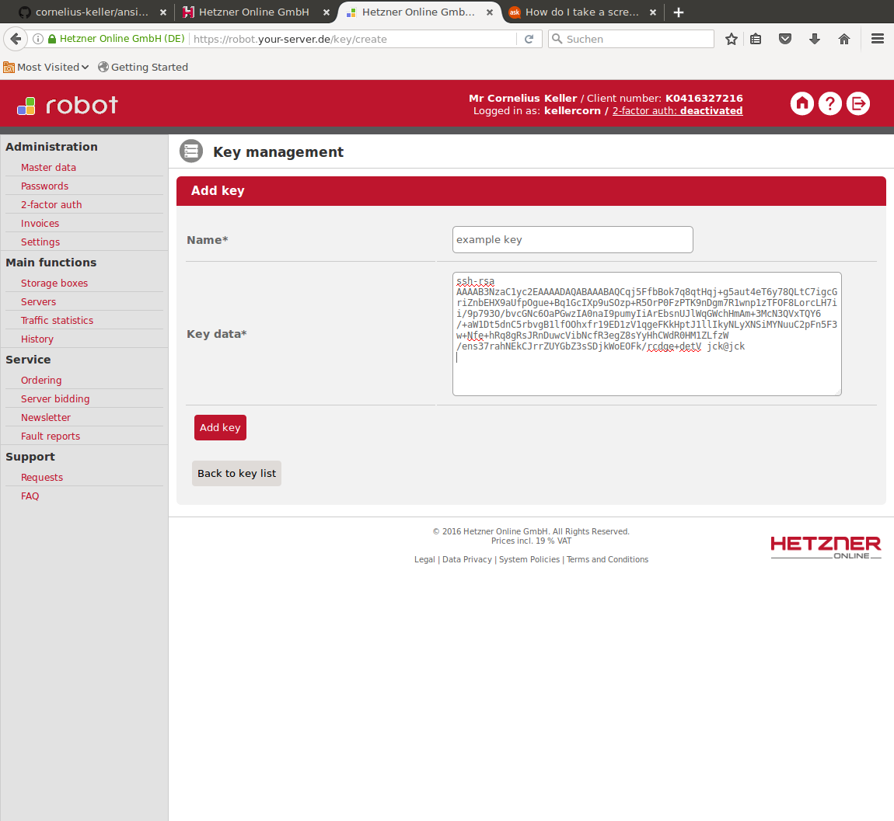
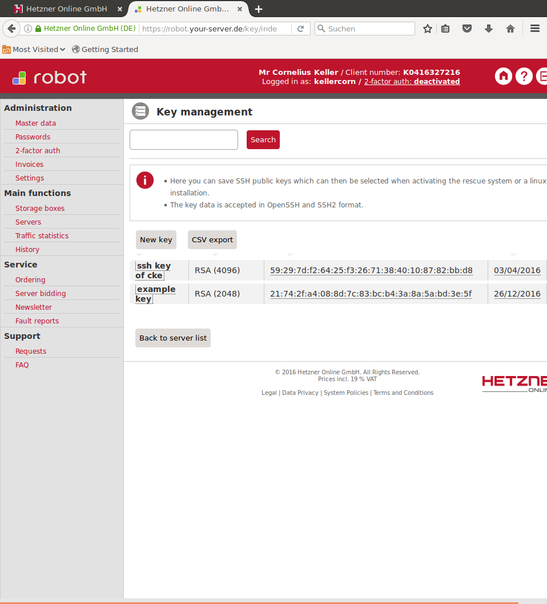
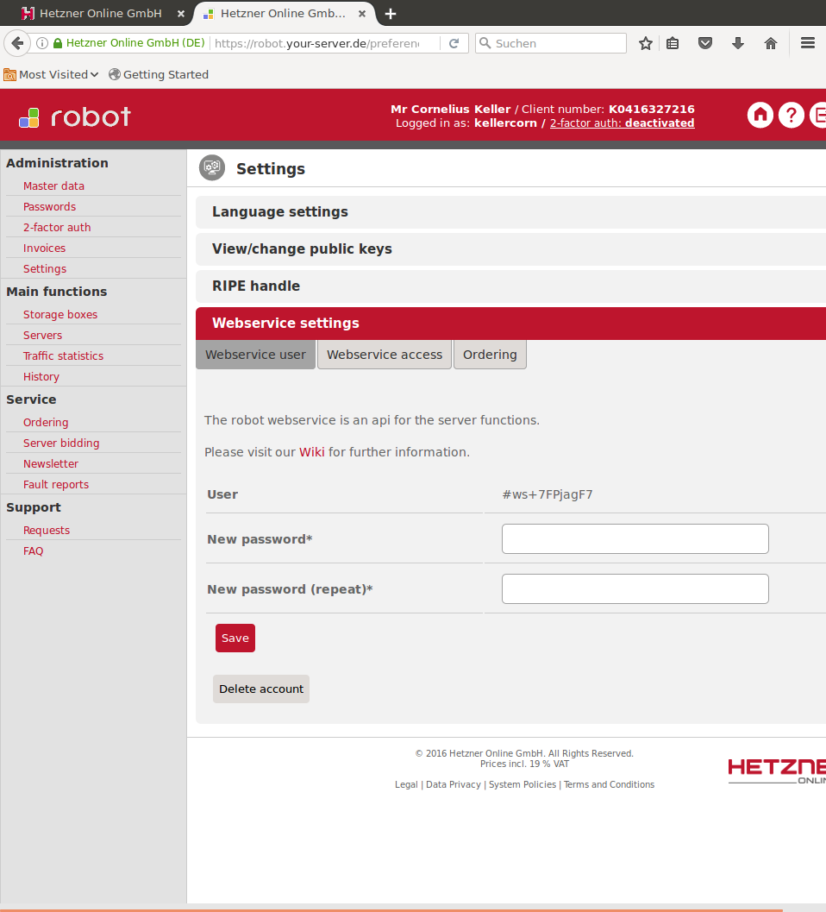

# Getting started on Hetzner

## clone and init submodules

    git clone https://github.com/cornelius-keller/ansible-coroeos-kubernetes.gi
    cd ansible-coroeos-kubernetes/
    git submodule init
    Submodule 'library' (https://github.com/cornelius-keller/ansible-ovh) registered for path 'library'
    Submodule 'roles/ansible-coreos-bootstrap' (https://github.com/sigma/ansible-coreos-bootstrap.git) registered for path 'roles/ansible-coreos-bootstrap'
    git submodule init
    Submodule 'library' (https://github.com/cornelius-keller/ansible-ovh) registered for path 'library'
    Submodule 'roles/ansible-coreos-bootstrap' (https://github.com/sigma/ansible-coreos-bootstrap.git) registered for path 'roles/ansible-coreos-bootstrap'
    git submodule update
    Cloning into 'library'...
    remote: Counting objects: 18, done.
    remote: Total 18 (delta 0), reused 0 (delta 0), pack-reused 18
    Unpacking objects: 100% (18/18), done.
    Checking connectivity... done.
    Submodule path 'library': checked out 'f87a217cef869a7c2ce69178441cb02299b321b2'
    Cloning into 'roles/ansible-coreos-bootstrap'...
    remote: Counting objects: 314, done.
    remote: Total 314 (delta 0), reused 0 (delta 0), pack-reused 313
    Receiving objects: 100% (314/314), 1.01 MiB | 1.03 MiB/s, done.
    Resolving deltas: 100% (131/131), done.
    Checking connectivity... done.
    Submodule path 'roles/ansible-coreos-bootstrap': checked out '8cd508c21868babdf32a7e0ec078df77cdf49611'

## upload ýour public key to Hetzner
* Log into the the Hetzner robot.
* Navigate to the server list in the left menu.


* chose key management
  
* chooose new key, give it a name, and copy the output of

  `cat ~/.ssh/id_rsa.pub`

 into the form and save it.
 

* copy the id of the key for use in the inventory. 

## create an inventory
```
  mkdir ../ansible-coreos-inventory 
  cp inventory-hetzner.ini.sample the ../ansible-coreos-inventory/inventory-hetzner.ini
```
 
* change the ips of your servers to match your server ips.
* copy the id of your public key you uploaded to hetzner into the inventory value `rescue_authorized_key`
* create a robot account and copy the username and password into the inventory.


  For Examble:

      hetzner_webservice_username=#ws+7FPjagF7
      hetzner_webservice_password=<your password>

* create a uuid and key for ceph

      # uuidgen
      3867334c-2a6d-4468-b970-c878f0d36fee
      # python ceph-key.py
      AQCBK2FYAAAAABAAxcEwUSSPc7Zt1VJ9fjYH8A==


* add to the ceph fsid and key to the  inventory

```
ceph_fsid=3867334c-2a6d-4468-b970-c878f0d36fee
ceph_key=AQCBK2FYAAAAABAAxcEwUSSPc7Zt1VJ9fjYH8A==
```

* add the public keys to the inventory that should have accces to the cluster:

      `mkdir ../ansible-coreos-inventory/group_vars`
* add the public keys that should have access to to the cluster to the file: `../ansible-coreos-inventory/group_vars../ansible-coreos-inventory/group_vars/all.yml`
For example:

```
coreos_public_keys:
- "ssh-rsa AAAAB3NzaC1yc2EAAAADAQABAAABAQCqj5FfbBok7q8qtHqj+g5aut4eT6y78QLtC7igcGriZnbEHX9aUfpOgue+Bq1GcIXp9uSOzp+R5OrP0FzPTK9nDgm7R1wnp1zTFOF8LorcLH7ii/9p793O/bvcGNc6OaPGwzIA0naI9pumyIiArEbsnUJlWqGWchHmAm+3McN3QVxTQY6/+aW1Dt5dnC5rbvgB1lfOOhxfr19ED1zV1qgeFKkHptJ1llIkyNLyXNSiMYNuuC2pFn5F3w+Nfe+hRq8gRsJRnDuwcVibNcfR3egZ8sYyHhCWdR0HM1ZLfzW/ens37rahNEkCJrrZUYGbZ3sSDjkWoEOFk/rcdge+detV jck@jck"
```
Your inventory shuld now look like this:

     [etcd-node]
     176.9.123.237 coreos_hostname=core01
     176.9.122.117 coreos_hostname=core02
     176.9.118.230 coreos_hostname=core03
     [etcd-proxy]


     [coreos:children]
     etcd-node
     etcd-proxy

     [kubernetes-master]
     176.9.123.237
     176.9.122.117
     [kubernetes-node]
     176.9.118.230
     [kubernetes:children]
     kubernetes-master
     kubernetes-node
     [ceph-mon]
     176.9.123.237
     176.9.122.117
     176.9.118.230
     [ceph-osd]
     176.9.123.237
     176.9.122.117
     176.9.118.230

     [all:vars]
     #kube_master_dns_name=kubemaster.bettertest.de
     hyperkube_aci=quay.io/cornelius/hyperkube
     hyperkube_aci_tag=v1.4.4_coreos.0
     kube_master_ip=176.9.123.237
     kube_cluster_name=privat
     kubernetes_version=1.4.4
     k8s_service_ip_range=10.100.0.0/16
     k8s_service_ip=10.100.0.1
     k8s_dns_service_ip=10.100.0.10
     k8s_dns_domain=cluster.local
     hetzner_webservice_username=#ws+7FPjagF7
     hetzner_webservice_password=justforthedemo
     baremetal_provider=hetzner
     kubectl_checksum=1ffbcfdec9961093b5fb1eec0b65f37af71a825dafff733de90d6ed6db647729
     ansible_python_interpreter=/home/core/pypy/bin/python
     ceph_fsid=3867334c-2a6d-4468-b970-c878f0d36fee
     ceph_key=AQCBK2FYAAAAABAAxcEwUSSPc7Zt1VJ9fjYH8A==
     ceph_osd_dir=/home/core/data/ceph/osd
     ceph_osd_type=osd_disk
     ceph_osd_device=/dev/sdb
     rescue_authorized_key=21:74:2f:a4:08:8d:7c:83:bc:b4:3a:8a:5a:bd:3e:5f

# bootsrap your coreos cluster

    # ansible-playbook -i ../ansible-coreos-inventory/inventory-hetzner.ini bootstrap_coreos.yml

You should see an output like this:

[](https://asciinema.org/a/3gcyoj8ddki0i5f2t9fhpjfw6)

Check if the bootstrap was successfull:
```
# kubectl get nodes
NAME            STATUS    AGE
176.9.118.230   Ready     9m
176.9.122.117   Ready     9m
176.9.123.237   Ready     10m
```
To ceck if the ceph cluster is healthy you can log into one of the nodes and issue `ceph -s`

    ssh core@176.9.118.230
    Last login: Mon Dec 26 17:07:36 UTC 2016 from 84.191.220.116 on pts/0
    CoreOS stable (1185.5.0)
    Update Strategy: No Reboots
    Failed Units: 1
    locksmithd.service
    core@core03 ~ $ ceph -s
    cluster 3867334c-2a6d-4468-b970-c878f0d36fee
     health HEALTH_WARN
            80 pgs degraded
            80 pgs stuck unclean
            80 pgs undersized
            recovery 40/60 objects degraded (66.667%)
     monmap e1: 3 mons at {ceph-mon-j8h1q=10.1.43.6:6789/0,ceph-mon-pbv8y=10.1.3.3:6789/0,ceph-mon-uvril=10.1.56.3:6789/0}
            election epoch 6, quorum 0,1,2 ceph-mon-pbv8y,ceph-mon-j8h1q,ceph-mon-uvril
      fsmap e5: 1/1/1 up {0=mds-ceph-mds-2484866350-hu4o7=up:active}
     osdmap e15: 2 osds: 2 up, 2 in
            flags sortbitwise
      pgmap v32: 80 pgs, 3 pools, 2068 bytes data, 20 objects
            78568 kB used, 5576 GB / 5576 GB avail
            40/60 objects degraded (66.667%)
                  80 active+undersized+degraded

If the cluster is unhealthy try again after a few minutes unil you see someting like this:


    core@core03 ~ $ ceph -s
    cluster 3867334c-2a6d-4468-b970-c878f0d36fee
    health HEALTH_OK
    monmap e1: 3 mons at {ceph-mon-j8h1q=10.1.43.6:6789/0,ceph-mon-pbv8y=10.1.3.3:6789/0,ceph-mon-uvril=10.1.56.3:6789/0}
       election epoch 6, quorum 0,1,2 ceph-mon-pbv8y,ceph-mon-j8h1q,ceph-mon-uvril
     fsmap e5: 1/1/1 up {0=mds-ceph-mds-2484866350-hu4o7=up:active}
    osdmap e20: 3 osds: 3 up, 3 in
       flags sortbitwise
    pgmap v50: 80 pgs, 3 pools, 2068 bytes data, 20 objects
       116 MB used, 8364 GB / 8364 GB avail
             80 active+clean


Cluster check asciicast:

[](https://asciinema.org/a/0d08oqnx4ioxqf0vjecd1zbfl)
